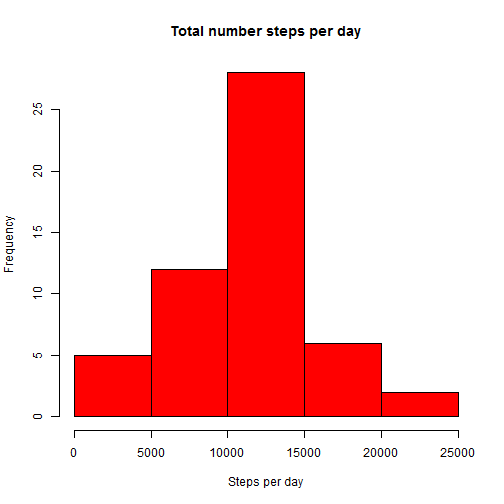
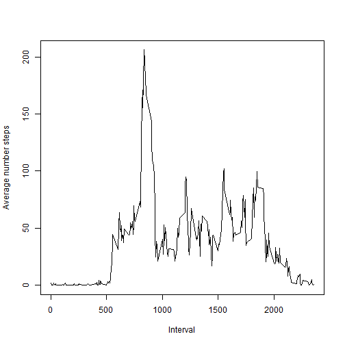
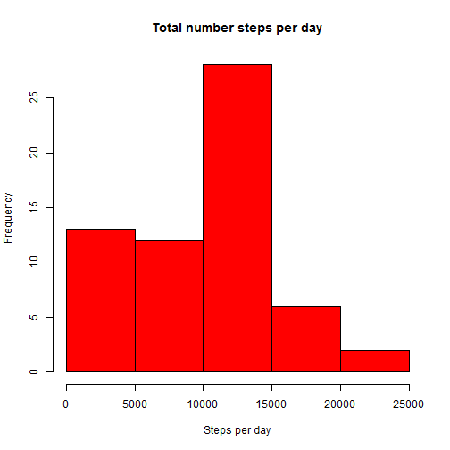

# Reproducible Research: Peer Assessment 1

## Loading and preprocessing the data
Workdirectory has already been set. Within the workdirectory the required files for this assignment are located in subdir "activity".
Load the data from CSV file in this directory, then show summary.

```r
myfile = "activity/activity.csv"
df <- read.csv(file = myfile, sep = ",", na.strings = "NA", stringsAsFactors = FALSE)
summary(df)
```

```
##      steps           date              interval   
##  Min.   :  0.0   Length:17568       Min.   :   0  
##  1st Qu.:  0.0   Class :character   1st Qu.: 589  
##  Median :  0.0   Mode  :character   Median :1178  
##  Mean   : 37.4                      Mean   :1178  
##  3rd Qu.: 12.0                      3rd Qu.:1766  
##  Max.   :806.0                      Max.   :2355  
##  NA's   :2304
```

## What is mean total number of steps taken per day?
Mean total number of steps per day is asked, which is an aggregation of steps by day. I choose to use a data.table, hence require to load the library as well.

```r
library(data.table)
dt <- data.table(df)
dt.total_steps_by_day <- dt[, list(steps = sum(steps)), by = "date"]
hist(dt.total_steps_by_day$steps, main = "Total number steps per day", xlab = "Steps per day", 
    col = "red")
```

 

There are several ways to get the mean and median of the total number of steps taken per day. Just read it from the summary over the aggregated set.

```r
summary(dt.total_steps_by_day$steps)
```

```
##    Min. 1st Qu.  Median    Mean 3rd Qu.    Max.    NA's 
##      41    8840   10800   10800   13300   21200       8
```

Another option is to remove NA values during the aggregation, and just call mean() and median() over the column "steps". Like this...

```r
dt.total_steps_by_day2 <- dt[complete.cases(dt), list(steps = sum(steps)), by = "date"]
mean(dt.total_steps_by_day2$steps)
```

```
## [1] 10766
```

```r
median(dt.total_steps_by_day2$steps)
```

```
## [1] 10765
```

## What is the average daily activity pattern?
The time series plot: 
  (x-axis) 5-minute interval
  (y-axis) average number of steps taken, across all days
Use a different aggregate, based on column interval. Also remove NA values.

```r
dt.mean_steps_by_interval <- dt[complete.cases(dt), list(steps = mean(steps)), 
    by = "interval"]
plot(x = dt.mean_steps_by_interval$interval, y = dt.mean_steps_by_interval$steps, 
    type = "l", col = "black", main = "", xlab = "Interval", ylab = "Average number steps")
```

 

The 5-minute interval, on average across all the days in the dataset, contains the maximum number 
dt.s2[which.max( dt.s2$steps )]

## Imputing missing values
Total number of rows with NA values, use original data frame.

```r
sum(!complete.cases(df))
```

```
## [1] 2304
```

I choose to fill the missing values with 0.

```r
df.no_NA <- df
df.no_NA[is.na(df.no_NA)] <- 0
```

Histogram of total number of steps taken each day

```r
dt.no_NA <- data.table(df.no_NA)
dt.no_NA.total_steps_by_day <- dt.no_NA[, list(steps = sum(steps)), by = "date"]
hist(dt.no_NA.total_steps_by_day$steps, main = "Total number steps per day", 
    xlab = "Steps per day", col = "red")
```

 


```r
mean(dt.no_NA.total_steps_by_day$steps)
```

```
## [1] 9354
```


```r
median(dt.no_NA.total_steps_by_day$steps)
```

```
## [1] 10395
```

These results are different compared to the first part of the assignment. By replacing NA with 0, the average total number of steps per day go down, as a result the median shifts towards lower values as well.

## Are there differences in activity patterns between weekdays and weekends?
Create new factor variable in the dataset with 2 levels - "weekday" and "weekend".
In order to get labels/captions in English, set the Locale
Show the first few rows, as prove it worked.

```r
Sys.setlocale("LC_TIME", "English")
```

```
## [1] "English_United States.1252"
```

```r
df.no_NA$dayofweek <- factor(weekdays(as.POSIXct(df.no_NA$date, format = "%Y-%m-%d")))
levels(df.no_NA$dayofweek) <- list(weekend = c("Sunday", "Saturday"), weekday = c("Monday", 
    "Tuesday", "Wednesday", "Thursday", "Friday"))
head(df.no_NA)
```

```
##   steps       date interval dayofweek
## 1     0 2012-10-01        0   weekday
## 2     0 2012-10-01        5   weekday
## 3     0 2012-10-01       10   weekday
## 4     0 2012-10-01       15   weekday
## 5     0 2012-10-01       20   weekday
## 6     0 2012-10-01       25   weekday
```


